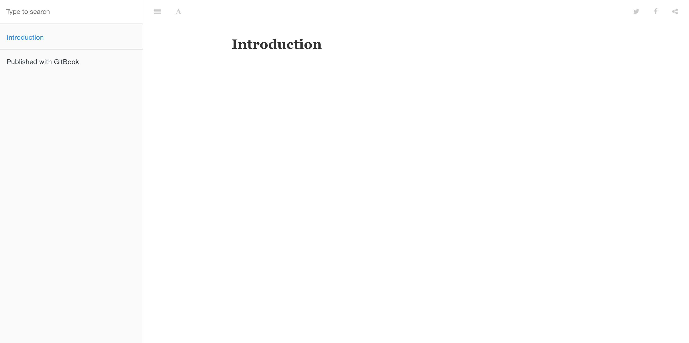
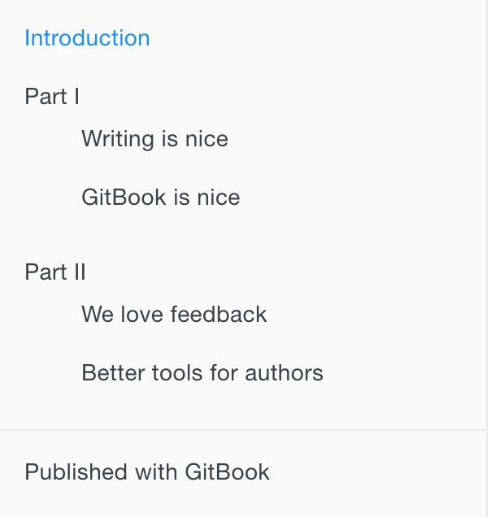
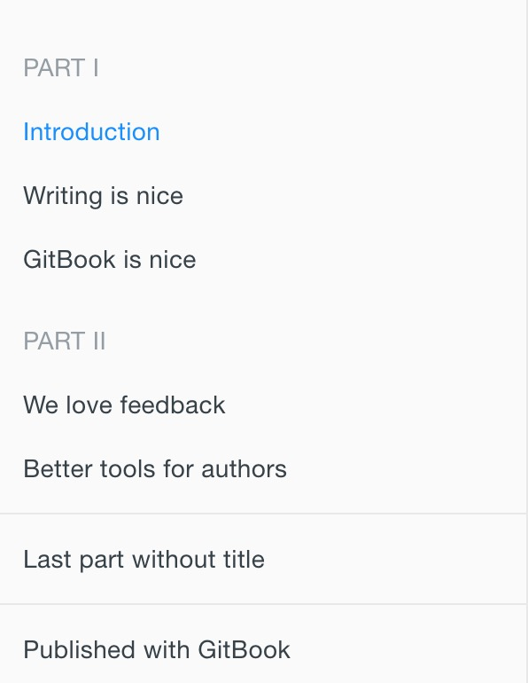

# GitBook 使用教程

首先先献上 [我的 GitBook 地址](https://blankj.com/gitbook/)，可以在我的 [博客](https://blankj.com/) 导航栏处找到，下面进行相关的介绍。

## 背景

由于之前都把零散的知识都写在 [Gist](https://gist.github.com) 上，要查找的时候不是很系统化，所以打算挪到 [GitBook](https://www.gitbook.com) 上来统一管理，而且 [GitBook](https://www.gitbook.com) 写完编译后可以生成静态页面发布到博客上，逼格满满的样子。


## GitBook 简介

* [GitBook 官网](https://www.gitbook.com)
* [GitBook 文档](https://github.com/GitbookIO/gitbook)


## GitBook 准备工作

### 安装 Node.js

GitBook 是一个基于 Node.js 的命令行工具，下载安装 [Node.js](https://nodejs.org/en)，安装完成之后，你可以使用下面的命令来检验是否安装成功。

```
$ node -v
v7.7.1
```


### 安装 GitBook

输入下面的命令来安装 GitBook。

```
$ npm install gitbook-cli -g
```

安装完成之后，你可以使用下面的命令来检验是否安装成功。

```
$ gitbook -V
CLI version: 2.3.2
GitBook version: 3.2.3
```

更多详情请参照 [GitBook 安装文档](https://github.com/GitbookIO/gitbook/blob/master/docs/setup.md) 来安装 GitBook。


### 安装 GitBook 编辑器

去 [GitBook 官网](https://www.gitbook.com/) 下载 GitBook 编辑器；如果是 Mac 用户且安装过 `brew cask` 的话可以使用 `brew cask install gitbook-editor` 命令行来安装 GitBook 编辑器。


## 先睹为快

GitBook 准备工作做好之后，我们进入一个你要写书的目录，输入如下命令。

```
$ gitbook init
warn: no summary file in this book
info: create README.md
info: create SUMMARY.md
info: initialization is finished
```

可以看到他会创建 README.md 和 SUMMARY.md 这两个文件，README.md 应该不陌生，就是说明文档，而 SUMMARY.md 其实就是书的章节目录，其默认内容如下所示：

```
# Summary

* [Introduction](README.md)
```

接下来，我们输入 `$ gitbook serve` 命令，然后在浏览器地址栏中输入 ` http://localhost:4000` 便可预览书籍。

效果如下所示：



运行该命令后会在书籍的文件夹中生成一个 `_book` 文件夹, 里面的内容即为生成的 html 文件，我们可以使用下面命令来生成网页而不开启服务器。

```
gitbook build
```

下面我们来详细介绍下 GitBook 目录结构及相关文件。

## 目录结构

GitBook 基本的目录结构如下所示：

```
.
├── book.json
├── README.md
├── SUMMARY.md
├── chapter-1/
|   ├── README.md
|   └── something.md
└── chapter-2/
    ├── README.md
    └── something.md
```

下面我们主要来讲讲 book.json 和 SUMMARY.md 文件。

### book.json

该文件主要用来存放配置信息，我先放出我的配置文件。

```json
{
    "title": "Blankj's Glory",
    "author": "Blankj",
    "description": "select * from learn",
    "language": "zh-hans",
    "gitbook": "3.2.3",
    "styles": {
        "website": "/styles/website.css"
    },
    "structure": {
        "readme": "README.md"
    },
    "links": {
        "sidebar": {
            "我的狗窝": "https://blankj.com"
        }
    },
    "plugins": [
        "-sharing",
        "splitter",
        "expandable-chapters-small",
        "anchors",

        "github",
        "github-buttons",
        "donate",
        "sharing-plus",
        "anchor-navigation-ex",
        "favicon"
    ],
    "pluginsConfig": {
        "github": {
            "url": "https://github.com/Blankj"
        },
        "github-buttons": {
            "buttons": [{
                "user": "Blankj",
                "repo": "glory",
                "type": "star",
                "size": "small",
                "count": true
                }
            ]
        },
        "donate": {
            "alipay": "https://blankj.com/gitbook/source/images/donate.png",
            "title": "",
            "button": "赞赏",
            "alipayText": " "
        },
        "sharing": {
            "douban": false,
            "facebook": false,
            "google": false,
            "hatenaBookmark": false,
            "instapaper": false,
            "line": false,
            "linkedin": false,
            "messenger": false,
            "pocket": false,
            "qq": false,
            "qzone": false,
            "stumbleupon": false,
            "twitter": false,
            "viber": false,
            "vk": false,
            "weibo": false,
            "whatsapp": false,
            "all": [
                "google", "facebook", "weibo", "twitter",
                "qq", "qzone", "linkedin", "pocket"
            ]
        },
        "anchor-navigation-ex": {
            "showLevel": false
        },
        "favicon":{
            "shortcut": "./source/images/favicon-32x32.webp",
            "bookmark": "./source/images/favicon-32x32.webp",
            "appleTouch": "./source/images/apple-touch-icon.webp"
        }
    }
}
```

相信很多节点自己也能猜到是什么意思，我还是简单介绍下吧。

#### title
本书标题

#### author
本书作者

#### description
本书描述

#### language
本书语言，中文设置 "zh-hans" 即可

#### gitbook
指定使用的 GitBook 版本

#### styles
自定义页面样式

#### structure
指定 Readme、Summary、Glossary 和 Languages 对应的文件名

#### links
在左侧导航栏添加链接信息

#### plugins
配置使用的插件

#### pluginsConfig
配置插件的属性


### SUMMARY.md

这个文件主要决定 GitBook 的章节目录，它通过 Markdown 中的列表语法来表示文件的父子关系，下面是一个简单的示例：

```
# Summary

* [Introduction](README.md)
* [Part I](part1/README.md)
    * [Writing is nice](part1/writing.md)
    * [GitBook is nice](part1/gitbook.md)
* [Part II](part2/README.md)
    * [We love feedback](part2/feedback_please.md)
    * [Better tools for authors](part2/better_tools.md)
```

这个配置对应的目录结构如下所示:



我们通过使用 `标题` 或者 `水平分割线` 将 GitBook 分为几个不同的部分，如下所示：

```
# Summary

### Part I

* [Introduction](README.md)
* [Writing is nice](part1/writing.md)
* [GitBook is nice](part1/gitbook.md)

### Part II

* [We love feedback](part2/feedback_please.md)
* [Better tools for authors](part2/better_tools.md)

---

* [Last part without title](part3/title.md)
```

这个配置对应的目录结构如下所示:




## 插件

GitBook 有 [插件官网](https://plugins.gitbook.com/)，默认带有 5 个插件，highlight、search、sharing、font-settings、livereload，如果要去除自带的插件， 可以在插件名称前面加 `-`，比如：

```
"plugins": [
    "-search"
]
```

如果要配置使用的插件可以在 book.json 文件中加入即可，比如我们添加 [plugin-github](https://plugins.gitbook.com/plugin/github)，我们在 book.json 中加入配置如下即可：

```
{
    "plugins": [ "github" ],
    "pluginsConfig": {
        "github": {
            "url": "https://github.com/your/repo"
        }
    }
}
```

然后在终端输入 `gitbook install ./` 即可。

如果要指定插件的版本可以使用 plugin@0.3.1，因为一些插件可能不会随着 GitBook 版本的升级而升级。


## 结语

这是我对 GitBook 使用的总结，希望能帮到今后需要的小伙伴。
